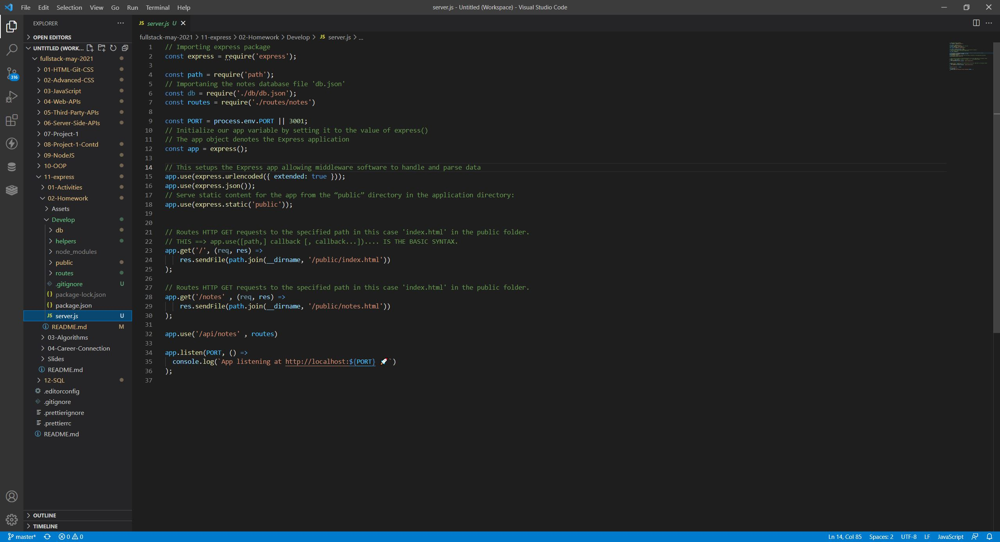
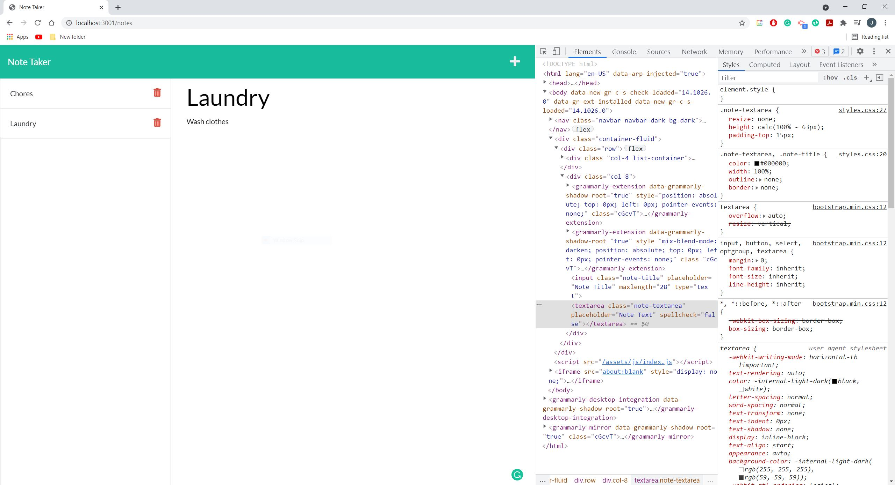
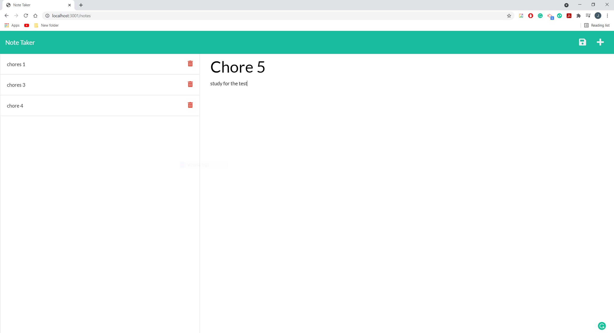

## Project Title: Note Taker App

  ## Description:
  The application allows users to write down notes for anything such as chores or appoitments or anything one could think of that requires reminding.

  ## Table of Contents
  * [Installation](#installation)
  * [Usage](#usage)
  * [Contributors](#contributors)
  * [License](#license)
  * [Tests](#tests)
  * [Questions](#questions)
  

  ## Installation
  -- What technologies did the application require in order to run smoothly and effectively?--

  The technology used in this application include Javascript, CSS, HTML, Node, Express and various other npm packages.

  ## Usage
  -- What is the application used for? --

  This application does not have a dedicated group of individuals. Instead anyone can use this application. Not can web developers can used the application to record different notes or patches to make, other people individuals can use this as a way to sort ideas or keep track of any type of appointments or notes they want to make for themselves. The application will be able to record new notes and display them on the left column of the application where they can be accessed if needed. These notes can also be deleted when the delete button is pressed. Overall, a useful application for the busy everyday worker.

  ## License
  -- Are there any license the application has? --

  This Application is covered by the MIT license.

  [License Information](https://opensource.org/licenses/MIT)

  

  ## Contributors
  -- Were there any contributors to the application/project --

  Contributors: Justin Liao

  ## Tests
  -- How can we test the application --

  The application node in visual studio can be used to test the app. once the file is loaded on the visual studios make sure that modules are installed through 'npm i'. You must have Express installed in order for this application to run properly. Also, make sure that the Node is installed to run the javascript files. Once ran through VS studio, a link will take you to the working application.

  ## Questions
  -- Have any questions? --

  Please reach out to me if you have any questions. Contact me at: jyliao369@gmail.com

  -- Want to see the repo of the project --

  Interested in seeing other projects I have worked on? My repository can be accessed here: 
  https://github.com/jyliao369

  ## Demonstration
  -- Simple Demonstration --
  .gif)

  ## Screenshots/Pictures
  -- Basic Code for application --
  

  -- Application Running in Browser --
  

  -- Final Application --
  

  ## Live Links
  Github Repo: https://github.com/jyliao369/Note_Taker_APP

  Deployed Link: 

  Heroku Live Link: https://blooming-plateau-18611.herokuapp.com/notes

  